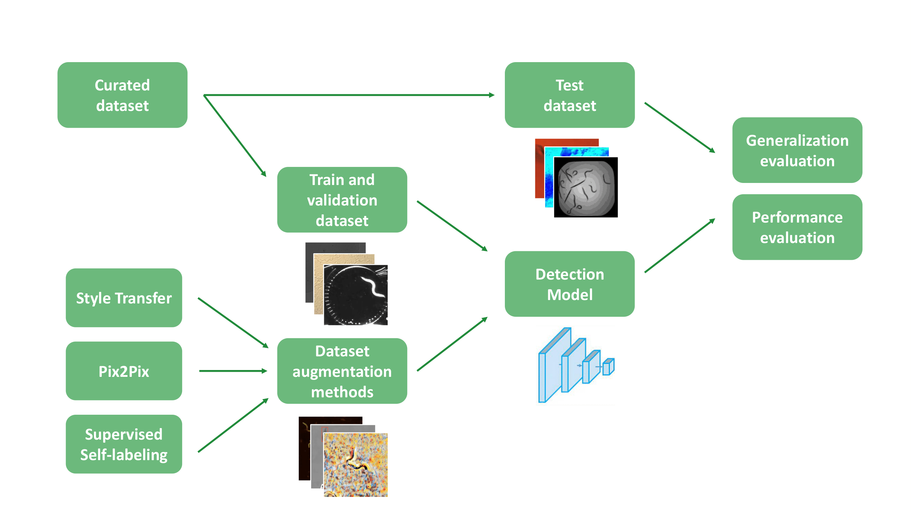

# Towards Generalization for _caenorhabditis elegans_ detection

Generalist _C. elegans_ detection using YOLO models

### Use the models

To use the models, download the weights `model.pt` and follow the instructions from the corresponding repository.

#### [YOLOv5](https://github.com/ultralytics/yolov5/)

`git clone https://github.com/ultralytics/yolov5  # clone`
`cd yolov5`
`pip install -r requirements.txt  # install`

`python detect.py --weights model.pt --img 1728 --source './path/to/source'`

#### [YOLOv7](https://github.com/WongKinYiu/yolov7)

`git clone https://github.com/ultralytics/yolov5  # clone`
`cd yolov5`
`pip install -r requirements.txt  # install`

`python detect.py --weights model.pt --conf 0.25 --img-size 1728 --source './path/to/source'`

#### [YOLOv8](https://github.com/ultralytics/ultralytics)

`pip install ultralytics`

`from ultralytics import YOLO`
`# Load a model`
`model = YOLO("yolov8n.pt")`
`results = model('./path/to/source')`

### Curated dataset sources

A list of the videos used to compose the dataset can be consulted in [dataset source](./imgs.md).
